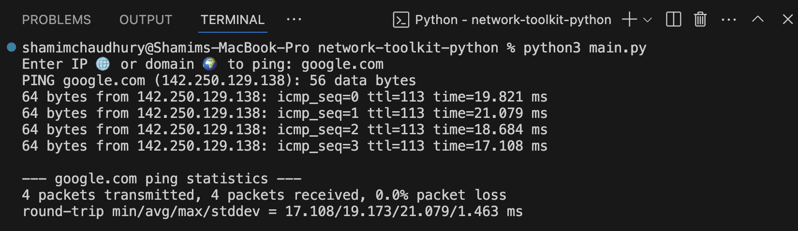

<h1 align="center">🔧 NetScanPro — Python Network Toolkit</h1>

<p align="center">
  A lightweight Python toolkit for real-world networking tasks like <strong>ping</strong>, <strong>DNS lookup</strong>, and <strong>port scanning</strong>.<br>
  Built to turn networking theory into something practical, hands-on, and beginner-friendly.
</p>

<p align="center">
  
  
  
</p>

---

## 🧠 Why I Built This

To practice and reinforce real networking skills from my DevOps training at CoderCo:
- IPs, MACs, DNS, and subnets
- Troubleshooting and diagnostics
- Building usable CLI tools in Python

---

## 🚀 Features

| 🔧 Feature         | Description                               | Status       |
|--------------------|-------------------------------------------|--------------|
| 🛰️ Ping Tool       | Run ICMP ping on any domain or IP address | ✅ Available |
| 🌐 DNS Lookup      | Resolve A, MX, NS records                 | 🔜 Coming    |
| 🔍 Port Scanner    | Scan common TCP ports                     | 🔜 Coming    |
| 📡 Subnet Scanner  | Discover hosts in a CIDR subnet           | 📝 Planned   |

---

## 🖥️ Example Output

Here's what running the **Ping Tool** looks like in your terminal:

<h3 align="center"> 📸 Ping Tool Demo</h3>

<p align="center">
  
  </p>

---

## ⚙️ How to Run Locally

1. 🎭 **Clone the repo:**
```bash
git clone https://github.com/shamimchadgit/network-toolkit-python.git
cd network-toolkit-python
python3 main.py

